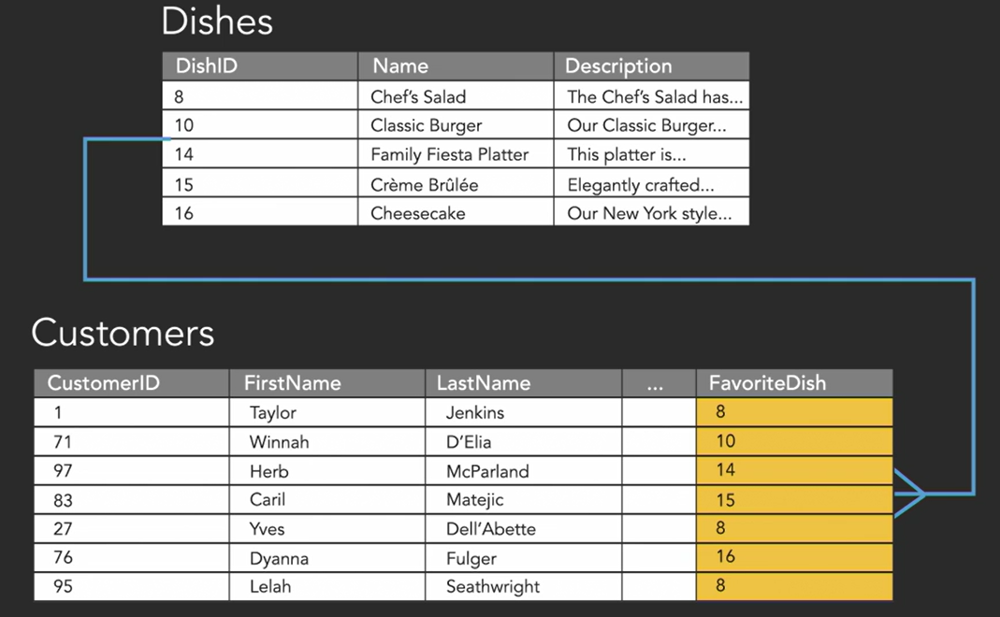
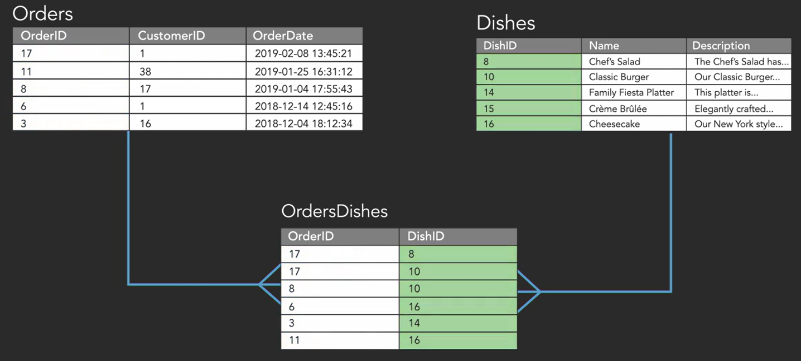
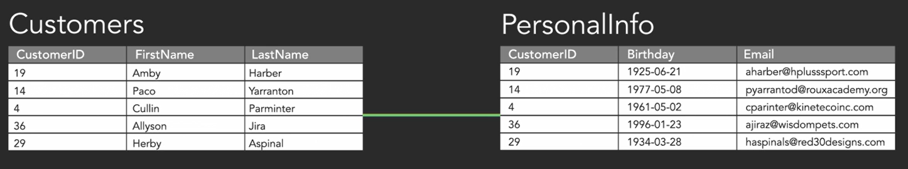

## **Introduction**
---

### Benefits of spreadsheets:
1. Data is in structured format
2. Helps to see gaps in data (i.e missing values)

### Benefits of databases:
1. Structured format
2. Allow enforcement of rules for data (data type, no missing values, unique value)
3. Define multiple tables & the relationship b/w them (foreign keys)
4. Protect data from unauthorized access 

---
> Schema: Structure of tables in database
---
> There are diff types of databases: relational databases, graph databases, object databases, document databases
---

## **Relation Databases**
- Table rows represent instances of a given entity (Ex: In customer table, each row represents a customer)
- Column represents attributes of each entity. 
- Set of columns is called a relation.
- Hence an RDMS is made up of relations or tables (set of columns). 
- Primary key : unique key for each row
- Composite key : 2 or more fields taken together to form unique identifier
- 3 types of database relationships: one-to-many, one-to-one, many-to-many
- ACID:
    - Transaction: set of operations that must all be completed. If one of the operations fail, the transaction is rolled back, else commited
    - Transaction follow ACID principle:
        - **Atomic**: A transaction is a single unit & it cannot be broken further. By this, we mean that either the entire transaction takes place at once or doesn’t happen at all.
        - **Consistency**: This means that integrity constraints must be maintained so that the database is consistent before and after the transaction. It refers to the correctness of a database
        - **Isolation**: While a transaction is being completed, nothing can modify the database
        - **Durable**: All changes after transaction, need to be updated to the database

## **ER diagram**
- Table name
    - Named with plural version of the entity (*Customers* if entity is customer)
    - Start with Capital 
    - No special characters & spaces
- Field names
    - Named singularly
    - UpperCamelCase (Each word capitalized and w/o spaces)
    - No special characters & spaces
- Field data type
    - CHAR(4): Fixed to 4 characters. Used when we know the exact length of string (ex: roll number, number plate etc)
    - VARCHAR(4): Variable with max limit of 4 characters. Used when we don't know the exact length (ex: name, place etc)
    - DATE
    - DATETIME
    - TIMESTAMP: saved when the record is updated. (depends on the DBMS)
    - DECIMAL (3,2): 3 digits before decimal & 2 digits after
    - Phone numbers are generally stored as CHAR type
    - BINARy: TRUE or FALSE
    - NULL: is it not a type, but a condition whether a cell has value or not. (correct: "value is NULL". Incorrect: "value is equal to NULL"). 

## **Relationships**

1. <u>One to Many relationship</u>:      
Example: Customer's fav dish. A customer can just have a single fav dish. But a dish can be fav of many customers (one-to-many / many-to-one)

2. <u>Many to Many relationship</u>:      
Here generally there is a Linking table that connects 2 one-to-many relations. Example: Food orders & the dishes in it. 

2. <u>One to One relationship</u>:      
Generally not used much as it is more logical to store one to one relation in the same row of the same table rather than create a new table. Example: Here the personal info of customer is seperated from the rest.  

## **Referencial Integrity**
Referential integrity is a constraint applied on foreign, which requires the foreign key to have a matching primary key or provided primary key is not a null value. Therefore, a constraint is specified between two tables, which makes sure reference from a row in one table to another is valid.

## **Normalization**

- Reduces redundancy of data
- Improves data integrity

---
Links for more understanding of normalization:
1. https://www.youtube.com/watch?v=jgUeOjImOOw
2. https://www.youtube.com/watch?v=9L10Q1nAfyg
3. https://www.youtube.com/watch?v=_K7fcFQowy8 
---

1. First Normal Form (1NF):
    - Rules:
        - values in each cell should be atomic (single value)
        - tables should not have repeating groups in diff columns
    - Hence:
        - tables cannot have duplicate rows
        - The order of rows and columns is not important to the data
    
    - Table that violates 1NF:    
    Here the columns, 'Course title 1', 'Course title 2' .. belong to the same group of values. Hence it violates
    
    - Resolving the above violation:   
    
2. Second Normal Form (2NF): 
    - Rules:
        - Must be in 1NF
        - A relation/column must not contain any partial dependencies (generally in the case of composite keys forming a primary key)

---
> course credit: https://www.linkedin.com/learning/programming-foundations-databases-2